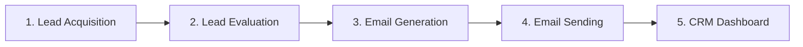
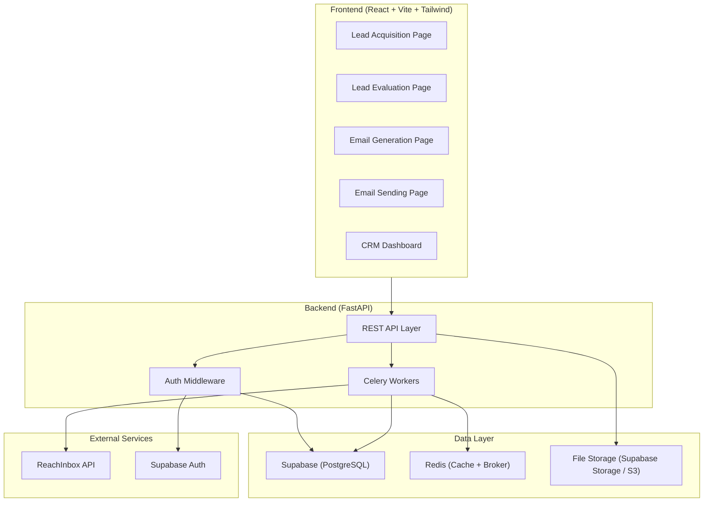
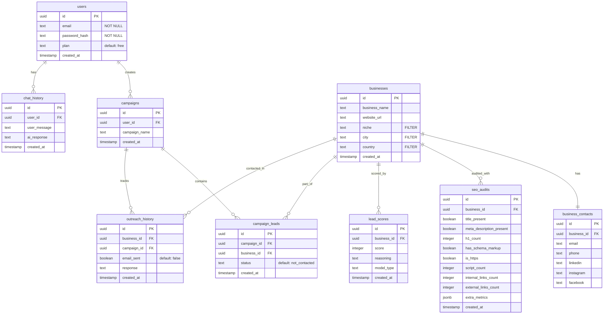

# LeadFlow SEO — System Architecture Overview

## 1. System Flow (End-to-End Pipeline)



### Step-by-Step Breakdown

| Step | What Happens | Input | Output |
|------|-------------|-------|--------|
| **1. Lead Acquisition** | Client selects filters (`niche`, `city`, `country`) → system queries `businesses` + `business_contacts` → returns matching leads → preview table + CSV download | Filter criteria | CSV file with lead data |
| **2. Lead Evaluation** | Leads are scored using evaluation model → results stored in `lead_scores` (score, reasoning, model_type). User can also upload their own CSV. | CSV from Step 1 or uploaded CSV | Scored CSV (with `score` + `reasoning` columns) |
| **3. Email Generation** | For each lead, a personalized email is generated using their `seo_audits` data (title, meta, h1, schema, https, links, etc.). Email content appended to the CSV. | Scored CSV + SEO audit data from DB | CSV with email columns appended |
| **4. Email Sending** | Emails dispatched via ReachInbox API as sending sequences. Tracked in `outreach_history` + `campaign_leads`. | Final CSV + sending config | Sent sequences tracked in DB |
| **5. CRM Dashboard** | Analytics: outreach status, response rates, lead scores distribution, campaign performance from `outreach_history` + `campaign_leads`. | Data from all steps | Visual analytics |

---

## 2. Architecture Diagram



---

## 3. Tech Stack

| Layer | Technology | Purpose |
|-------|-----------|---------|
| **Frontend** | React + Vite + Tailwind CSS | SPA with fast HMR, utility-first styling |
| **Backend API** | FastAPI | Async REST API, data validation with Pydantic |
| **Task Queue** | Celery + Redis | Background processing (evaluation, email gen, sending) |
| **Database** | Supabase (PostgreSQL) | Lead data, SEO audits, user data, analytics |
| **Auth** | Supabase Auth (or JWT-based) | User authentication & authorization |
| **File Storage** | Supabase Storage | CSV file storage, user uploads |
| **Email Sending** | ReachInbox API | Email sequences & campaign management |
| **Caching** | Redis | API response caching, rate limiting, Celery broker |

### Additional Recommendations

| Tool | Purpose |
|------|---------|
| **React Query (TanStack Query)** | Server-state management, caching, polling |
| **React Router v7** | Client-side routing |
| **Zustand** | Lightweight global state management |
| **Papa Parse** | Client-side CSV parsing/generation |
| **Recharts / Nivo** | Dashboard charts & data visualization |
| **React Table (TanStack Table)** | Lead data tables with sorting, filtering, pagination |
| **Docker + Docker Compose** | Local development & deployment containerization |

---

## 4. Database Schema (Actual Supabase)

> [!NOTE]
> This reflects the **real** schema from your Supabase instance. RLS is currently disabled.



### Available Lead Filters (from `businesses` table)

| Filter | Column | Type | Example Values |
|--------|--------|------|----------------|
| **Niche / Industry** | `niche` | text | "Restaurants", "Real Estate", "Dentists" |
| **City** | `city` | text | "New York", "London", "Karachi" |
| **Country** | `country` | text | "US", "UK", "PK" |

### SEO Audit Fields (for email personalization)

| Field | Type | Used For |
|-------|------|----------|
| `title_present` | boolean | "Your website is missing a title tag..." |
| `meta_description_present` | boolean | "No meta description found..." |
| `h1_count` | integer | "Your page has 0/multiple H1 tags..." |
| `has_schema_markup` | boolean | "No structured data detected..." |
| `is_https` | boolean | "Your site isn't using HTTPS..." |
| `script_count` | integer | Performance analysis |
| `internal_links_count` | integer | Internal linking strategy |
| `external_links_count` | integer | Link profile analysis |
| `extra_metrics` | jsonb | Extensible audit data |

---

## 5. Project Structure (Placeholder)

```
FYP-1/
├── frontend/                    # React + Vite + Tailwind
│   ├── src/
│   │   ├── components/          # Reusable UI components
│   │   │   ├── common/          # Buttons, Inputs, Modals, Tables
│   │   │   ├── layout/          # Sidebar, Navbar, PageWrapper
│   │   │   └── charts/          # Dashboard chart components
│   │   ├── pages/
│   │   │   ├── LeadAcquisition/ # Filter, Preview, Download
│   │   │   ├── LeadEvaluation/  # Score leads, Upload CSV
│   │   │   ├── EmailGeneration/ # Generate personalized emails
│   │   │   ├── EmailSending/    # ReachInbox sequences
│   │   │   ├── Dashboard/       # CRM analytics
│   │   │   └── Auth/            # Login, Register
│   │   ├── hooks/               # Custom React hooks
│   │   ├── services/            # API client functions
│   │   ├── store/               # Zustand state stores
│   │   ├── utils/               # Helpers (CSV parsing, formatters)
│   │   ├── App.jsx
│   │   └── main.jsx
│   ├── tailwind.config.js
│   ├── vite.config.js
│   └── package.json
│
├── backend/                     # FastAPI + Celery
│   ├── app/
│   │   ├── api/
│   │   │   ├── routes/
│   │   │   │   ├── leads.py     # Lead acquisition endpoints
│   │   │   │   ├── evaluation.py# Lead evaluation endpoints
│   │   │   │   ├── emails.py    # Email generation endpoints
│   │   │   │   ├── sending.py   # Email sending (ReachInbox)
│   │   │   │   ├── dashboard.py # CRM analytics endpoints
│   │   │   │   └── auth.py      # Auth endpoints
│   │   │   └── deps.py          # Shared dependencies
│   │   ├── core/
│   │   │   ├── config.py        # Settings & environment vars
│   │   │   ├── security.py      # JWT, auth helpers
│   │   │   └── celery_app.py    # Celery configuration
│   │   ├── models/              # SQLAlchemy / Pydantic models
│   │   │   ├── lead.py
│   │   │   ├── user.py
│   │   │   ├── campaign.py
│   │   │   └── email.py
│   │   ├── schemas/             # Pydantic request/response schemas
│   │   ├── services/            # Business logic layer
│   │   │   ├── lead_service.py
│   │   │   ├── evaluation_service.py
│   │   │   ├── email_gen_service.py
│   │   │   ├── sending_service.py
│   │   │   └── analytics_service.py
│   │   ├── tasks/               # Celery tasks
│   │   │   ├── evaluate_leads.py
│   │   │   ├── generate_emails.py
│   │   │   └── send_emails.py
│   │   └── main.py              # FastAPI app entry point
│   ├── requirements.txt
│   └── Dockerfile
│
├── docker-compose.yml           # Redis, Backend, Frontend, Celery Worker
├── .env.example
└── README.md
```

---

## 6. What You Need to Set Up

### Immediately (Before Coding)
1. ~~**Supabase Project**~~ ✅ **Done** — Schema exists and is populated
2. **Node.js 18+** — For React/Vite frontend
3. **Python 3.11+** — For FastAPI backend
4. **Redis** — Install locally or use Docker (`docker run -d -p 6379:6379 redis`)
5. **ReachInbox API Key** — Sign up and get API credentials
6. **Docker & Docker Compose** — For containerized development
7. **Supabase credentials** — URL, anon key, service role key (for `.env`)

---

## 7. ❓ Remaining Information Needed

> [!NOTE]
> ~~Filters~~, ~~Database fields~~, ~~SEO audit structure~~ — all resolved from schema.

### Still Needed (provide when ready)

| # | Item | Status | Default |
|---|------|--------|---------|
| 1 | **Evaluation model** (script/logic) | 🔲 You'll provide later | Will create placeholder |
| 2 | **Email generation script** | 🔲 You'll provide later | Will create placeholder |
| 3 | **ReachInbox API docs / endpoints** | 🔲 Needed for Phase 5 | Will stub integration |
| 4 | **UI reference image** | 🔲 Not yet attached | Will use dark premium theme |
| 5 | **Auth approach** — custom JWT (you have `password_hash`) or Supabase Auth? | 🔲 Need decision | Will use custom JWT matching your `users` table |

---

## 8. Recommended Development Order

```mermaid
gantt
    title Development Phases
    dateFormat  X
    axisFormat %s

    section Phase 1 - Foundation
    Project setup (Vite + FastAPI + Docker)  :a1, 0, 1
    Auth system                               :a2, 1, 2
    Database schema + migrations              :a3, 1, 2

    section Phase 2 - Lead Acquisition
    Filter UI                                 :b1, 2, 3
    Lead query API                            :b2, 2, 3
    Preview table + CSV download              :b3, 3, 4

    section Phase 3 - Lead Evaluation
    CSV upload + processing                   :c1, 4, 5
    Evaluation model integration              :c2, 4, 5
    Score display + export                    :c3, 5, 6

    section Phase 4 - Email Generation
    SEO audit integration                     :d1, 6, 7
    Email generation engine                   :d2, 6, 7
    Preview + CSV export                      :d3, 7, 8

    section Phase 5 - Email Sending
    ReachInbox integration                    :e1, 8, 9
    Sequence builder UI                       :e2, 8, 9
    Sending + tracking                        :e3, 9, 10

    section Phase 6 - CRM Dashboard
    Analytics API                             :f1, 10, 11
    Dashboard charts                          :f2, 10, 11
```



**Phase 1** is what we'll build first — the scaffolding with placeholder pages for every step.
