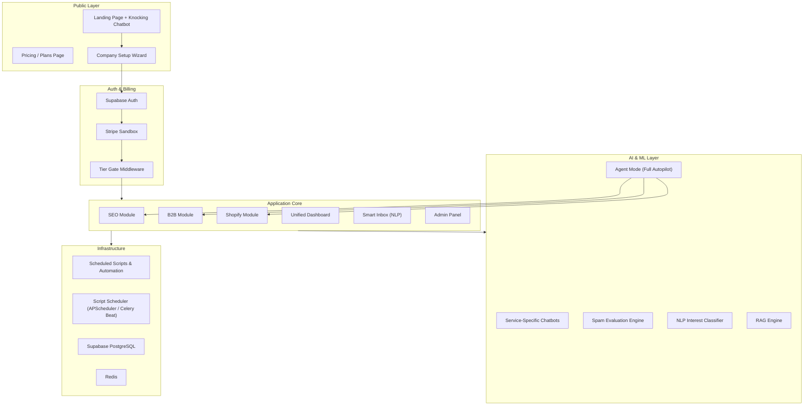
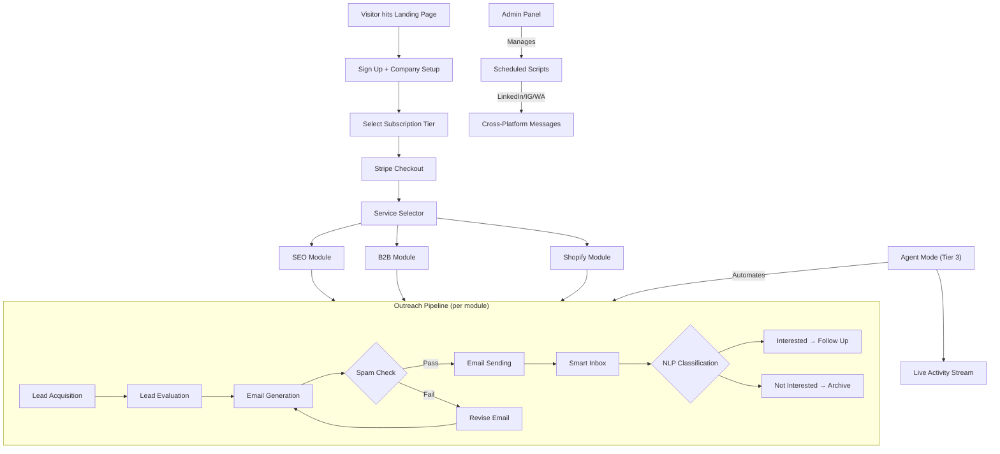

# N-Services — Complete Architecture & Implementation Plan

> **"N-Services: A door-to-door salesman for your services."**

This document consolidates every proposed feature into a structured, LLM-readable blueprint. It describes **what exists today**, **what needs to change**, and **how everything connects**.

---

## 1. Current State Summary

### What Exists Today

| Layer | Details |
|-------|---------|
| **Frontend** | React + Vite + Tailwind. 3 service modules: **SEO**, **B2B**, **Shopify AI** |
| **Backend** | FastAPI (Python 3.11+). Routes for leads, evaluation, emails, sending, dashboard, onebox, shopify, b2b |
| **Auth** | Supabase Auth (email + password, magic link verification) |
| **Database** | Supabase (PostgreSQL) — tables: `users`, `businesses`, `business_contacts`, `seo_audits`, `lead_scores`, `campaigns`, `campaign_leads`, `outreach_history`, `chat_history` |
| **AI** | Gemini 2.0 Flash (SEO emails), Groq (B2B), ChromaDB RAG (Shopify), Smythos agent (B2B sequences) |
| **CRM** | ReachInbox API integration for email sending, Onebox for inbox |
| **Chatbot** | `FloatingAssistant.jsx` — SEO Expert Agent (floating bubble, bottom-right) |

### Current Route Map

```
/                    → ServiceSelector (pick SEO / B2B / Shopify)
/login, /signup      → Auth pages
/seo/*               → SEO module (dashboard, leads, evaluation, email-gen, email-sending, onebox)
/b2b/*               → B2B module (dashboard, leads, evaluation, email-gen, outreach, onebox)
/shopify/*           → Shopify module (home, onboard, launch, leads, dashboard, admin, chat)
```

---

## 2. High-Level Target Architecture



---

## 3. Feature Breakdown

### 3.1 Landing Page — "Knocking on Doors"

**Concept**: A public marketing page with an animated chatbot character that "knocks" on a door animation, inviting visitors in.

| Item | Detail |
|------|--------|
| **Route** | `/` (public, replaces current `ServiceSelector` for unauthenticated users) |
| **Animation** | Lottie/CSS keyframe: door + chatbot character knocking sequence |
| **CTA** | "Let us knock on doors for you" → Sign Up / Login |
| **Chatbot** | Lightweight FAQ bot (no auth required) answering "What is N-Services?" etc. |
| **Content** | Hero section, service cards (SEO/B2B/Shopify), pricing preview, testimonials |

**Files to create**: `frontend/src/pages/LandingPage.jsx`, `frontend/src/components/landing/KnockingBot.jsx`, `frontend/src/components/landing/HeroSection.jsx`

---

### 3.2 Enhanced Dashboard

**Current state**: Basic KPI cards + placeholder chart areas. No map. No interactivity.

**Target state**:

| Feature | Implementation |
|---------|---------------|
| **World Map** | `react-simple-maps` or `deck.gl` — plot lead locations by `city`/`country` from `businesses` table. Clickable regions to drill into leads |
| **Service Flow Chart** | Interactive Mermaid or `reactflow` diagram: Apollo → Extraction → Evaluation → Email Gen → Sending. Clickable nodes navigate to each module |
| **Interactive Charts** | Replace placeholder divs with Recharts/Nivo: funnel chart (leads→emails→replies), time-series (daily sends), heatmap (best send times) |
| **Real-time KPIs** | WebSocket or polling for live campaign stats from ReachInbox |

**Files to modify**: `Dashboard.jsx`, `SEODashboard.jsx`, `B2BDashboard.jsx`, `ShopifyDashboard.jsx`
**Files to create**: `components/charts/WorldMap.jsx`, `components/charts/ServiceFlowChart.jsx`, `components/charts/FunnelChart.jsx`, `components/charts/HeatmapChart.jsx`

---

### 3.3 Multi-Service Chatbots

**Current**: Single `FloatingAssistant.jsx` (SEO-only, calls `/api/assistant`).

**Target**: Context-aware chatbot that switches personality/knowledge per active module.

| Module | Bot Persona | Knowledge Base |
|--------|------------|----------------|
| SEO | SEO Expert Agent | SEO audits, meta tags, schema markup |
| B2B | B2B Sales Coach | Apollo data, buyer personas, email sequences |
| Shopify | Store Assistant | RAG-powered product knowledge (already exists in `StoreChat.jsx`) |

**Implementation**: Modify `FloatingAssistant.jsx` to accept a `mode` prop. Backend: create `/api/assistant/b2b` route (new) alongside existing `/api/assistant` (SEO). Shopify already has its own chat.

---

### 3.4 Sign-Up & Company Setup Wizard

**Current**: Basic email/password sign-up → lands on ServiceSelector.

**Target**: Multi-step onboarding wizard:

```
Step 1: Account Creation (email, password)
Step 2: Company Profile (name, industry, website, size)
Step 3: Service Selection (which modules: SEO / B2B / Shopify)
Step 4: Subscription Tier Selection + Stripe Checkout
Step 5: Confirmation → redirect to dashboard
```

**New DB table**: `companies`

```sql
CREATE TABLE companies (
  id UUID PRIMARY KEY DEFAULT gen_random_uuid(),
  user_id UUID REFERENCES auth.users(id),
  name TEXT NOT NULL,
  industry TEXT,
  website TEXT,
  size TEXT, -- 'solo', 'small', 'medium', 'enterprise'
  selected_services TEXT[], -- ['seo', 'b2b', 'shopify']
  created_at TIMESTAMPTZ DEFAULT now()
);
```

**Files to create**: `frontend/src/pages/onboarding/CompanySetup.jsx`, `backend/app/api/routes/onboarding.py`

---

### 3.5 Subscription Tiers + Stripe

**Three tiers**:

| Tier | Name | Access | Price |
|------|------|--------|-------|
| **1 — Starter** | DIY Outreach | Full platform access. User performs all steps manually | $29/mo |
| **2 — Pro** | Agent-Assisted | Everything in Starter + AI chatbot assistants in each module that guide & suggest | $79/mo |
| **3 — Enterprise** | Full Autopilot | Everything in Pro + Agent Mode: AI runs the entire pipeline autonomously, user just receives results via email | $199/mo |

**Implementation**:

| Component | Detail |
|-----------|--------|
| **Stripe Sandbox** | `@stripe/stripe-js` + `@stripe/react-stripe-js` on frontend. `stripe` Python SDK on backend |
| **Backend routes** | `/api/billing/create-checkout-session`, `/api/billing/webhook`, `/api/billing/portal` |
| **Tier gating** | Middleware that reads `users.plan` column → blocks Agent features for Starter, blocks Autopilot for Pro |
| **DB change** | Add `subscription_tier` (text), `stripe_customer_id` (text), `stripe_subscription_id` (text) to `users` table |

**Files to create**: `backend/app/api/routes/billing.py`, `frontend/src/pages/Pricing.jsx`, `frontend/src/components/billing/CheckoutForm.jsx`

---

### 3.6 Agent Mode (Full Autopilot)

**Concept**: For Tier 3 users. An autonomous agent that executes the entire pipeline: Lead Acquisition → Evaluation → Email Generation → Sending. The user sees a live activity stream in human-readable language (similar to Antigravity's thinking display).

**UI**: A dedicated "Agent Mode" page with:
- A **live activity log** panel showing step-by-step what the agent is doing in natural language (e.g., "🔍 Searching for restaurant leads in London...", "📊 Evaluating 47 leads...", "✉️ Generating personalized emails...")
- **Configuration panel**: user sets target niche, location, volume, tone
- **Start/Stop** controls
- **Results summary** when complete

**Backend**: A new orchestrator service that chains existing services:

```python
# backend/app/services/agent_orchestrator.py
class AgentOrchestrator:
    async def run_pipeline(self, config, progress_callback):
        await progress_callback("Searching for leads...")
        leads = await lead_service.acquire(config.niche, config.city)
        await progress_callback(f"Found {len(leads)} leads. Evaluating...")
        scored = await evaluation_service.score(leads)
        await progress_callback(f"Scored leads. Generating emails for top {config.count}...")
        emails = await email_service.generate(scored[:config.count])
        await progress_callback("Sending campaign...")
        await sending_service.dispatch(emails, config.campaign_name)
        await progress_callback("✅ Pipeline complete!")
```

**Live updates**: WebSocket (`/ws/agent-status`) streaming progress to frontend.

**Files to create**: `backend/app/services/agent_orchestrator.py`, `backend/app/api/routes/agent.py`, `frontend/src/pages/AgentMode.jsx`, `frontend/src/components/agent/ActivityStream.jsx`

---

### 3.7 Automated Cross-Platform Messaging Scripts

**Concept**: Scripts that send messages through LinkedIn, Instagram, WhatsApp, etc. Managed via Admin Panel.

| Script | Channel | Method |
|--------|---------|--------|
| LinkedIn Outreach | LinkedIn | Playwright/Puppeteer automation or LinkedIn API |
| Instagram DMs | Instagram | Instagram Graph API or browser automation |
| WhatsApp Blast | WhatsApp | Twilio WhatsApp API or WhatsApp Business API |

**Files to create**: `backend/scripts/linkedin_outreach.py`, `backend/scripts/instagram_dm.py`, `backend/scripts/whatsapp_sender.py`, `backend/app/api/routes/scripts.py`

---

### 3.8 Admin Panel & Script Scheduler

**Current**: Shopify has its own `AdminDashboard.jsx` + `AdminLogin.jsx`.

**Target**: A unified admin panel for the entire platform.

| Feature | Detail |
|---------|--------|
| **Script Manager** | View all automation scripts, enable/disable, see last run status |
| **Schedule Editor** | Cron-like scheduler UI — set scripts to run at intervals (APScheduler or Celery Beat) |
| **User Management** | View all users, their tiers, usage stats |
| **System Health** | API uptime, Redis status, Celery worker status |
| **Logs Viewer** | View agent activity logs, script execution logs |

**Files to create**: `frontend/src/pages/admin/AdminPanel.jsx`, `frontend/src/pages/admin/ScriptManager.jsx`, `frontend/src/pages/admin/ScheduleEditor.jsx`, `backend/app/api/routes/admin.py`, `backend/app/services/scheduler.py`

---

### 3.9 ML Engine Additions

#### 3.9.1 Spam Evaluation Engine

**Purpose**: Score outgoing emails for spam likelihood before sending. Catches issues like spammy words, excessive caps, missing unsubscribe links.

| Component | Detail |
|-----------|--------|
| **Model** | Fine-tuned classifier (scikit-learn/HuggingFace) or rule-based SpamAssassin-style scorer |
| **Input** | Email subject + body |
| **Output** | Spam score (0-100), list of flagged issues, suggestions |
| **Integration** | Called during Email Generation step. Results shown as a "Spam Risk" badge on each email card |

**Files to create**: `backend/app/services/models/spam_evaluator.py`, `frontend/src/components/email/SpamScore.jsx`

#### 3.9.2 NLP Inbox Interest Classifier

**Purpose**: Automatically classify incoming Onebox emails as "Interested", "Not Interested", "Out of Office", "Unsubscribe".

| Component | Detail |
|-----------|--------|
| **Model** | Zero-shot classification (HuggingFace `transformers`) or Gemini prompt-based classification |
| **Integration** | Runs on new emails in Onebox. Adds filter chips to the inbox UI |
| **DB** | Add `interest_label` column to `outreach_history` |

**Files to modify**: `Onebox.jsx` (add filter by interest label), `backend/app/api/routes/onebox.py`
**Files to create**: `backend/app/services/models/interest_classifier.py`

---

### 3.10 Email Campaign Cards

**Current**: Email campaigns displayed in a table/list format.

**Target**: Campaign cards with visual design:

```
┌─────────────────────────────┐
│  📧 Spring SEO Campaign     │
│  Status: ● Active           │
│  ━━━━━━━━━━━━━━ 72% sent    │
│  Sent: 144  Opened: 89      │
│  Replied: 12  Bounced: 3    │
│  Created: Apr 28, 2026      │
└─────────────────────────────┘
```

**Files to modify**: `EmailSending.jsx`, `B2BOutreach.jsx`
**Files to create**: `frontend/src/components/email/CampaignCard.jsx`

---

### 3.11 Shopify Module — Email Gen + Integration Chatbot

**Current state**: Shopify module has Dashboard, AI Store Assistant (RAG), Lead Engine. No email generation or sending.

**Target additions**:

| Feature | Detail |
|---------|--------|
| **Email Generation Column** | Add email generation capability to Shopify leads (reuse SEO email gen service with Shopify-specific templates) |
| **Email Sending Column** | Push generated emails to ReachInbox from the Shopify module |
| **Integration Chatbot** | A specialized chatbot that guides users through embedding the Shopify AI assistant on their own website (generates embed code, API keys, webhook URLs) |

**Files to modify**: `shopify/Leads.jsx`, `shopify/HomeSelection.jsx`
**Files to create**: `frontend/src/pages/shopify/ShopifyEmailGen.jsx`, `frontend/src/pages/shopify/ShopifyEmailSend.jsx`, `frontend/src/components/shopify/IntegrationChatbot.jsx`, `backend/app/api/routes/shopify_emails.py`

---

### 3.12 Skeleton Loading Frames

**Current**: Most pages use a simple spinner (`Loader2 animate-spin`).

**Target**: Skeleton loading states (shimmer rectangles matching the layout shape) for every data-loading page.

**Files to create**: `frontend/src/components/common/Skeleton.jsx` (reusable shimmer component)
**Files to modify**: All pages that show loading states

---

### 3.13 Documentation Fixes

| Task | Detail |
|------|--------|
| **Add references** | Cite all third-party APIs, libraries, models used. Add a References section to README |
| **Fix use-case diagrams** | Update/create proper UML use-case diagrams reflecting the new multi-service architecture |
| **Update README** | Rebrand from "LeadFlow" to "N-Services", update project structure, feature list |

---

## 4. Complete Page Inventory

### Public Pages (No Auth)

| Page | Route | Status |
|------|-------|--------|
| Landing Page | `/` | 🆕 NEW |
| Pricing | `/pricing` | 🆕 NEW |
| Login | `/login` | ✅ EXISTS |
| Sign Up | `/signup` | 🔄 MODIFY (add company setup) |
| Forgot Password | `/forgot-password` | ✅ EXISTS |
| Reset Password | `/reset-password` | ✅ EXISTS |

### Authenticated Pages

| Page | Route | Status |
|------|-------|--------|
| Company Setup Wizard | `/onboarding` | 🆕 NEW |
| Service Selector | `/services` | 🔄 MODIFY (move from `/`) |
| Agent Mode | `/agent` | 🆕 NEW |
| Admin Panel | `/admin` | 🆕 NEW |
| Script Manager | `/admin/scripts` | 🆕 NEW |
| Schedule Editor | `/admin/schedules` | 🆕 NEW |

### SEO Module (`/seo/*`)

| Page | Route | Status |
|------|-------|--------|
| SEO Dashboard | `/seo/dashboard` | 🔄 MODIFY (add map, charts) |
| Lead Acquisition | `/seo/leads` | ✅ EXISTS |
| Lead Evaluation | `/seo/evaluation` | ✅ EXISTS |
| Email Generation | `/seo/email-generation` | 🔄 MODIFY (add spam score, cards) |
| Email Sending | `/seo/email-sending` | 🔄 MODIFY (campaign cards) |
| Onebox | `/seo/onebox` | 🔄 MODIFY (NLP filters) |

### B2B Module (`/b2b/*`)

| Page | Route | Status |
|------|-------|--------|
| B2B Dashboard | `/b2b/dashboard` | 🔄 MODIFY (add map, charts) |
| Lead Wizard | `/b2b/leads` | ✅ EXISTS |
| Lead Evaluation | `/b2b/evaluation` | ✅ EXISTS |
| Email Generation | `/b2b/email-generation` | 🔄 MODIFY (spam score, cards) |
| Outreach | `/b2b/outreach` | 🔄 MODIFY (campaign cards) |
| Onebox | `/b2b/onebox` | 🔄 MODIFY (NLP filters) |

### Shopify Module (`/shopify/*`)

| Page | Route | Status |
|------|-------|--------|
| Home Selection | `/shopify` | 🔄 MODIFY (add email & integration cards) |
| Dashboard | `/shopify/dashboard` | 🔄 MODIFY (enhanced charts) |
| Leads | `/shopify/leads` | 🔄 MODIFY (add email gen/send columns) |
| Email Generation | `/shopify/email-gen` | 🆕 NEW |
| Email Sending | `/shopify/email-send` | 🆕 NEW |
| Store Chat | `/shopify/chat/:storeId` | ✅ EXISTS |
| Integration Guide | `/shopify/integrate` | 🆕 NEW (chatbot-driven) |
| Admin | `/shopify/admin` | ✅ EXISTS |

---

## 5. Database Schema Additions

```sql
-- Company profiles (onboarding)
CREATE TABLE companies (
  id UUID PRIMARY KEY DEFAULT gen_random_uuid(),
  user_id UUID REFERENCES auth.users(id),
  name TEXT NOT NULL,
  industry TEXT,
  website TEXT,
  size TEXT,
  selected_services TEXT[],
  created_at TIMESTAMPTZ DEFAULT now()
);

-- Subscription tracking
ALTER TABLE users ADD COLUMN subscription_tier TEXT DEFAULT 'starter';
ALTER TABLE users ADD COLUMN stripe_customer_id TEXT;
ALTER TABLE users ADD COLUMN stripe_subscription_id TEXT;

-- Script registry
CREATE TABLE automation_scripts (
  id UUID PRIMARY KEY DEFAULT gen_random_uuid(),
  name TEXT NOT NULL,
  channel TEXT NOT NULL, -- 'linkedin', 'instagram', 'whatsapp', 'email'
  script_path TEXT NOT NULL,
  is_enabled BOOLEAN DEFAULT false,
  schedule TEXT, -- cron expression
  last_run_at TIMESTAMPTZ,
  last_status TEXT,
  created_by UUID REFERENCES auth.users(id),
  created_at TIMESTAMPTZ DEFAULT now()
);

-- Script execution logs
CREATE TABLE script_logs (
  id UUID PRIMARY KEY DEFAULT gen_random_uuid(),
  script_id UUID REFERENCES automation_scripts(id),
  status TEXT, -- 'success', 'error', 'running'
  output TEXT,
  started_at TIMESTAMPTZ,
  finished_at TIMESTAMPTZ
);

-- Agent mode runs
CREATE TABLE agent_runs (
  id UUID PRIMARY KEY DEFAULT gen_random_uuid(),
  user_id UUID REFERENCES auth.users(id),
  config JSONB NOT NULL,
  status TEXT DEFAULT 'pending',
  activity_log JSONB DEFAULT '[]',
  results JSONB,
  started_at TIMESTAMPTZ,
  completed_at TIMESTAMPTZ
);

-- NLP classification on inbox
ALTER TABLE outreach_history ADD COLUMN interest_label TEXT;
-- values: 'interested', 'not_interested', 'out_of_office', 'unsubscribe', NULL
```

---

## 6. System Flow — End to End



---

## 7. Backend API — New Routes Needed

| Route Prefix | File | Purpose |
|-------------|------|---------|
| `/api/billing/*` | `billing.py` | Stripe checkout, webhooks, portal |
| `/api/onboarding/*` | `onboarding.py` | Company setup, service selection |
| `/api/agent/*` | `agent.py` | Start/stop agent runs, WebSocket status |
| `/api/admin/*` | `admin.py` | User mgmt, script mgmt, system health |
| `/api/scripts/*` | `scripts.py` | CRUD for automation scripts, trigger runs |
| `/api/assistant/b2b` | `b2b_assistant.py` | B2B chatbot endpoint |
| `/api/ml/spam-check` | `ml.py` | Spam evaluation endpoint |
| `/api/ml/classify-interest` | `ml.py` | NLP interest classification |
| `/api/shopify/emails/*` | `shopify_emails.py` | Shopify email gen & send |
| `/ws/agent-status` | `agent.py` | WebSocket for agent live updates |

---

## 8. Phased Development Order

### Phase 1 — Foundation & Rebranding
- [ ] Rebrand LeadFlow → N-Services across codebase
- [ ] Create Landing Page with knocking chatbot animation
- [ ] Add skeleton loading frames to all pages
- [ ] Create reusable `Skeleton.jsx` component

### Phase 2 — Onboarding & Billing
- [ ] Build Company Setup wizard (multi-step form)
- [ ] Integrate Stripe Sandbox (checkout, webhooks, portal)
- [ ] Implement subscription tier gating middleware
- [ ] Add Pricing page

### Phase 3 — Dashboard Enhancements
- [ ] World Map visualization (lead locations)
- [ ] Interactive service flow chart
- [ ] Replace placeholder charts with Recharts/Nivo
- [ ] Funnel chart, time-series, heatmap

### Phase 4 — AI & ML Engines
- [ ] Spam Evaluation Engine (model + API + UI badge)
- [ ] NLP Interest Classifier for Onebox
- [ ] Multi-service chatbots (B2B bot, context switching)
- [ ] Email campaign cards UI

### Phase 5 — Agent Mode
- [ ] Agent orchestrator service (chains existing services)
- [ ] WebSocket for live activity streaming
- [ ] Agent Mode page with activity stream UI
- [ ] Manual vs. Agent mode toggle

### Phase 6 — Shopify Expansion
- [ ] Email generation for Shopify leads
- [ ] Email sending from Shopify module
- [ ] Integration chatbot (embed code generator)

### Phase 7 — Automation & Admin
- [ ] Cross-platform messaging scripts (LinkedIn, IG, WhatsApp)
- [ ] Script scheduler (APScheduler / Celery Beat)
- [ ] Admin Panel (scripts, users, health, logs)

### Phase 8 — Documentation
- [ ] Add references section to all docs
- [ ] Fix/create UML use-case diagrams
- [ ] Update README with new architecture

---

## Open Questions

> [!IMPORTANT]
> **Branding**: Are we fully rebranding from "LeadFlow" to "N-Services"? The landing page, all headers, and the README currently say "LeadFlow".

> [!IMPORTANT]
> **Stripe**: Do you already have a Stripe sandbox account set up, or should the plan include account creation steps?

> [!IMPORTANT]
> **Cross-platform scripts**: LinkedIn/Instagram automation carries ban risk. Should we use official APIs only (limited features) or browser automation (risky but more powerful)?

> [!IMPORTANT]
> **Agent Mode pricing**: Are the tier prices ($29/$79/$199) correct, or are those placeholders?

> [!IMPORTANT]
> **Shopify "Spotify" typo**: You mentioned "Spotify module" in your request — confirming this refers to the **Shopify** module?

---

## Verification Plan

### Automated Tests
- Backend: `pytest` for all new API routes (billing, agent, admin, ML)
- Frontend: Component rendering tests for new pages
- Stripe: Test webhook handling with Stripe CLI (`stripe listen`)
- ML models: Accuracy benchmarks on test datasets

### Manual Verification
- Walk through full onboarding flow (signup → company → tier → checkout)
- Test agent mode end-to-end with a small lead batch
- Verify tier gating (Starter user cannot access Agent features)
- Test cross-platform scripts in sandbox environments
- Visual review of all new dashboard charts and world map
